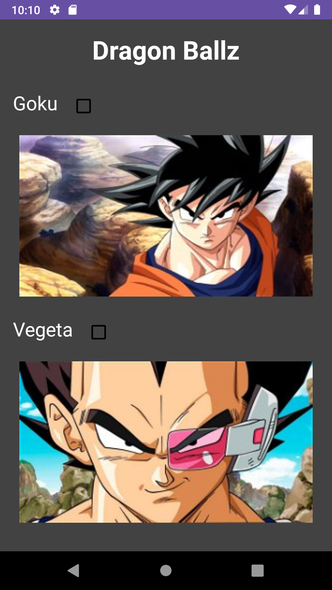
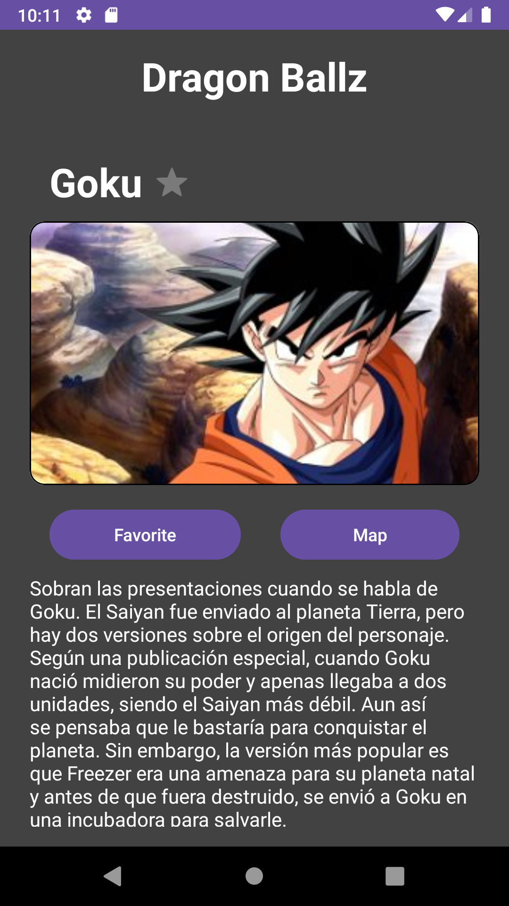
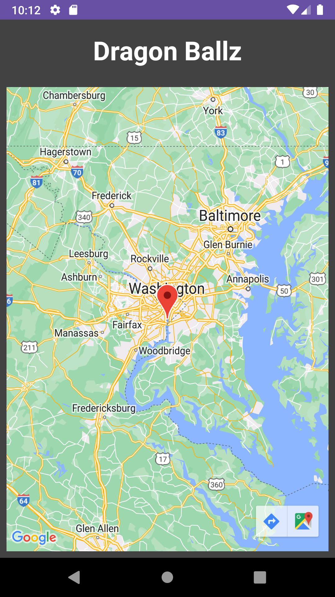

# Android-Advanced
Bootcamp project involving MVVM architecture, a Room local database, API connections using Retrofit, Google Maps, Hilt, and SOLID/clean principles.

The application presents a Dragon Ballz battle simulator using API data and login credentials. 
* The first window presents a user login with password. 
* The main screen presents a list of heroes for the user to choose from.
* The user can mark heroes as favorites.
* Hero locations will be display on a map.

NOTE: To use Google Maps function, you will need to supply a valid api key by either:
1. Add GOOGLE_MAPS_API_KEY = yourkey... to local.properties file or
2. Paste your api key value inside AndroidManifest.xml, line 37, android:value="${GOOGLE_MAPS_API_KEY}"  

## Screenshots

| Hero List                                                              | Hero Detail                                                              | Map Page                                                           |
|------------------------------------------------------------------------|--------------------------------------------------------------------------|--------------------------------------------------------------------|
|  |  |  |